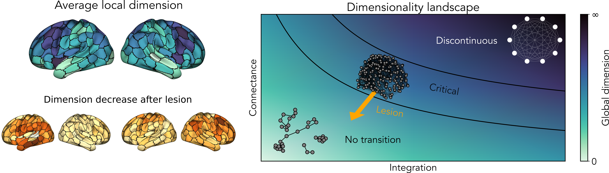

# Connectome Dimension

The structural connectome serves as the foundation for neural information signaling, playing a primary constraint on brain functionality. Yet, its influence on emergent dynamical properties is not fully understood.

By tracking the temporal evolution of diffusive perturbations, we estimate a scale-dependent measure of dimensionality of empirical connectomes. At the local scale, dimensionality is highly heterogeneous and follows a gradient from sensory-motor to executive areas. At the global scale, it encapsulates mesoscale topological information related to the balance between segregation and integration. Furthermore, by comparing connectomes from stroke patients, we find that dimensionality captures the local effects of lesions and, at a global level, is linked to impaired critical patterns and decreased behavioral performance.

Overall, the dimension of the connectome may serve as a powerful descriptor for bridging the gap between structure and function in the human brain.

  

## Main scripts
- [Dimensionality_synthetic](Dimensionality_synthetic.ipynb): create synthetic networks and compute their local and global dimensions
- [Dimensionality_connectome](Dimensionality_connectome.ipynb): compute the local and global dimensions of control and stroke subjects
- [HTC](HTC.ipynb): simulate the Haimovici-Tagliazucchi-Chialvo model informed by individual connectomes and compute relevant observables
- [Figures](Figures.ipynb): perform the statistical tests and generate the figures presented in the manuscript

## Additional analysis
- [Spectral_dimension](Spectral_dimension.ipynb): compute the spectral dimension of the connectomes
- [SBM](SBM.ipynb): perform community detection method by the inference of a stochastic block model
- [Figures_SI](Figures_SI.ipynb): perform the statistical tests and generate the figures presented in the supplementary materials

## Dependencies
* [DynGDim](https://github.com/barahona-research-group/DynGDim): computing the relative, local and global dimension of complex networks
* [graph-tool](https://git.skewed.de/count0/graph-tool): an efficient python module for analysis of graphs
* [neuromaps](https://github.com/netneurolab/neuromaps): comparisons between brain maps

## References
- van den Heuvel, M. P., & Sporns, O. (2019). A cross-disorder connectome landscape of brain dysconnectivity. Nature reviews neuroscience, 20(7), 435-446.
- Peach, R., Arnaudon, A., & Barahona, M. (2022). Relative, local and global dimension in complex networks. Nature Communications, 13(1), 3088.
- Rocha, R. P., Koçillari, L., Suweis, S., De Filippo De Grazia, M., de Schotten, M. T., Zorzi, M., & Corbetta, M. (2022). Recovery of neural dynamics criticality in personalized whole-brain models of stroke. Nature Communications, 13(1), 3683.
- Barzon, G., Nicoletti, G., Mariani, B., Formentin, M., & Suweis, S. (2022). Criticality and network structure drive emergent oscillations in a stochastic whole-brain model. Journal of Physics: Complexity, 3(2), 025010.
- Pini, L., Aarabi, M. H., Salvalaggio, A., Colletta, A. M., Metcalf, N. V., Griffis, J. C., ... & Corbetta, M. (2025). Longitudinal degeneration of microstructural and structural connectivity patterns following stroke. medRxiv, 2025-05.